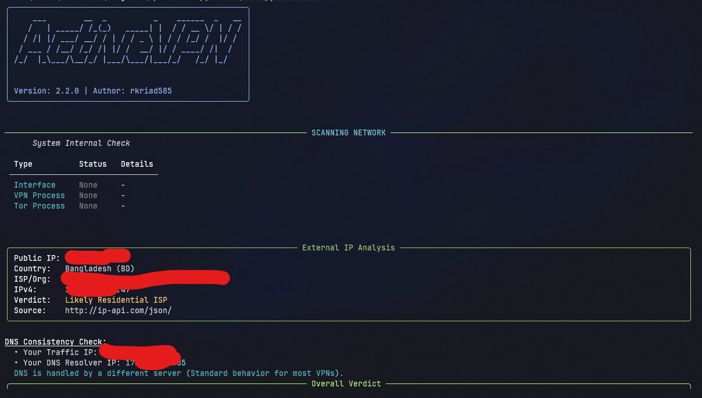

<p align="center">
  
</p>

<h1 align="center">🛡️ ActiveVPN</h1>

<p align="center">
  The Ultimate Network Privacy &amp; VPN Detection Tool
</p>

<p align="center">
  <a href="https://www.python.org/"></a>
  <a href="https://github.com/rkriad585/ActiveVPN/actions"></a>
  <!-- TODO: fill -- the CI badge only becomes live once the first workflow run completes on GitHub. -->
  <a href="https://pypi.org/project/activevpn/"></a>
  <a href="LICENSE"></a>
  <a href="https://github.com/rkriad585"></a>
</p>

<p align="center">
  ActiveVPN inspects your system's network interfaces, analyzes running processes, checks your
  external IP against known hosting providers, and performs DNS leak tests &mdash; all in one
  hacker-style terminal UI. It tells you whether your VPN is <em>actually</em> working.
</p>

## Screenshot

<p align="center">
  
</p>

<p align="center"><em>More screenshots: <a href="docs/screenshots.md">View all screenshots</a></em></p>

## Table of Contents

- [Key Features](#key-features)
- [Installation](#installation)
- [Quick Start](#quick-start)
- [Usage Examples](#usage-examples)
- [Documentation](#documentation)
- [Interface](#interface)
- [Architecture](#architecture)
- [Requirements](#requirements)
- [Prerequisites](#prerequisites)
- [Development](#development)
- [Contributing](#contributing)
- [Security](#security)
- [License](#license)
- [Acknowledgments](#acknowledgments)

## Key Features

- **Deep scan** — detects VPNs via interface names, process names, and IP reputation in one pass.
- **Tor detection** — specifically checks for active Tor services.
- **External IP analysis** — queries public IP APIs and flags datacenter/hosting/proxy IPs.
- **DNS leak detection** — compares your traffic IP with your DNS resolver IP.
- **IPv6 leak check** — reports your external IPv6 address and warns when IPv6 may leak around a tunnel.
- **Overall verdict** — combines every signal into a confidence score and a CLEAN / SUSPICIOUS / LIKELY VPN-PROXY / VPN DETECTED label.
- **Kill switch** — terminates active VPN processes, with a `--kill-force` fallback.
- **History & export** — automatically logs scans to your platform's data directory, viewable with `--history` and exportable as JSON, CSV, or TXT.
- **Library API** — importable as a Python package (`activevpn.scan()`, `NetworkDetector`, typed `ScanResult`), with silent mode and watch callbacks for developers.
- **Watch mode** — continuously re-scans at a configurable interval.
- **Configurable** — patterns, colors, and API endpoints can be overridden with a JSON config file.

## Installation

Requires **Python 3.8 or newer** and `pip`.

```bash
pip install activevpn
```

Or install from source:

```bash
git clone https://github.com/rkriad585/ActiveVPN.git
cd ActiveVPN
pip install -r requirements.txt
```

See [docs/installation.md](docs/installation.md) for platform-specific notes (Linux, macOS, Windows, Termux).

## Quick Start

```bash
# Run a full scan
activevpn
```

You should see a system check, an external IP analysis, a DNS consistency check, and an overall verdict.

## Usage Examples

```bash
# Standard network scan (interfaces, processes, IP, DNS)
activevpn

# Kill active VPN processes (requires admin/root)
sudo activevpn --kill

# Force-kill stubborn VPN processes
sudo activevpn --kill-force

# Show past scan results
activevpn --history

# Export scan history as CSV
activevpn --export csv

# Clear all saved history
activevpn --clear-history

# Continuously rescan every 30 seconds
activevpn --watch 30

# Verbose debug logging
activevpn --debug

# Show help
activevpn --help
```

Exit codes: `0` = no VPN detected, `1` = VPN/Tor/Proxy detected, `2` = offline or error. Full reference in [docs/cli.md](docs/cli.md).

## Documentation

| Doc | Description |
| --- | --- |
| [docs/getting-started.md](docs/getting-started.md) | First steps with ActiveVPN |
| [docs/installation.md](docs/installation.md) | Install instructions for every platform |
| [docs/usage.md](docs/usage.md) | Daily usage and examples |
| [docs/cli.md](docs/cli.md) | Full command-line reference |
| [docs/configuration.md](docs/configuration.md) | Config file and environment variables |
| [docs/architecture.md](docs/architecture.md) | How the code is organized |
| [docs/development.md](docs/development.md) | Building, testing, and packaging |
| [docs/deployment.md](docs/deployment.md) | Running on servers and in containers |
| [docs/faq.md](docs/faq.md) | Frequently asked questions |
| [docs/troubleshooting.md](docs/troubleshooting.md) | Common issues and fixes |
| [docs/screenshots.md](docs/screenshots.md) | All screenshots |

## Interface

ActiveVPN is a **command-line tool**. It is distributed as the `activevpn` console script (see `[project.scripts]` in `pyproject.toml`) and can also be launched with `python main.py`.

When run without flags it performs a full scan and prints four sections:

1. **System Internal Check** — detected VPN/Tor interfaces and processes.
2. **External IP Analysis** — public IP, country, ISP/org, IPv4/IPv6, and a verdict.
3. **DNS Consistency Check** — traffic IP vs. DNS resolver IP.
4. **Overall Verdict** — confidence score (`0`&ndash;`100`) and label.

The tool returns meaningful **exit codes** (`0`/`1`/`2`) so it can be used in scripts and CI.

## Architecture

```
ActiveVPN/
├── main.py               # Entry point + CLI (argparse) + rich TUI rendering
├── config.py             # Legacy shim → re-exports activevpn.config
├── pyproject.toml        # Packaging, metadata, console script
├── requirements.txt      # Runtime dependencies
├── activevpn/            # The library (importable as a package)
│   ├── __init__.py       # Public API: scan(), NetworkDetector, ScanResult, ...
│   ├── config.py         # Config dataclass, platformdirs paths, load_config()
│   ├── detector.py       # NetworkDetector + typed data model (ScanResult, Verdict, IPInfo, ...)
│   ├── logger.py         # History persistence, load/clear, and export helpers
│   ├── logo.py           # ASCII banner generation (pyfiglet + rich)
│   └── help.py           # Help menu rendering
├── core/                 # Backward-compatible shim (deprecated, use activevpn)
├── tests/                # pytest suite (mocked psutil/requests)
├── logo/                 # Brand logo
└── docs/                 # Documentation
```

The flow: `main.run()` parses arguments &rarr; `NetworkDetector.scan_network()` collects system + online signals &rarr; `_compute_verdict()` scores them &rarr; `save_log()` persists the result &rarr; tables/panels are rendered with `rich`.

## Using as a Library

```python
import activevpn

# One-shot scan (silent — no TUI)
result = activevpn.scan(console=None)
print(result.verdict.label, result.verdict.score)   # CLEAN 0
print(result.to_json())                             # serializable output

# Programmatic configuration (stored under ~/.config/neostore/ActiveVPN/)
cfg = activevpn.load_config()
cfg.vpn_process_names.append("my-vpn-daemon")

# Continuous watch with callbacks
detector = activevpn.NetworkDetector(console=None, config=cfg)
for r in detector.watch(interval=60, on_change=lambda r: print("Verdict changed!", r.verdict.label)):
    pass
```

See [docs/architecture.md](docs/architecture.md) for details.

## Requirements

| Requirement | Minimum |
| --- | --- |
| OS | Linux, macOS, Windows, or Android (Termux) |
| Runtime | Python 3.8+ |
| Network | Internet access for the public IP and DNS checks |

No special hardware is required. `--kill` and `--kill-force` need administrator/root privileges.

## Prerequisites

- **Python 3.8+** — download from [python.org](https://www.python.org/) or your package manager.
- **pip** — bundled with Python on modern installers.

On Linux:

```bash
sudo apt update && sudo apt install -y python3 python3-pip
```

On macOS (Homebrew):

```bash
brew install python
```

## Development

```bash
# Clone and install dependencies
git clone https://github.com/rkriad585/ActiveVPN.git
cd ActiveVPN
python -m venv .venv
. .venv/bin/activate        # Windows: .venv\Scripts\Activate.ps1
pip install -r requirements.txt pytest build twine

# Run the test suite
pytest -q

# Build the distributable packages
python -m build

# Verify the built artifacts
python -m twine check dist/*
```

The CI workflow (`.github/workflows/ci.yml`) runs `pytest` on Ubuntu, Windows, and macOS with Python 3.8 and 3.12. See [docs/development.md](docs/development.md).

## Contributing

Contributions are welcome! Please read [CONTRIBUTING.md](CONTRIBUTING.md) for setup, branch rules, commit style, and the pull request workflow. All participants must follow the [CODE_OF_CONDUCT.md](CODE_OF_CONDUCT.md).

## Security

If you find a security issue, please read [SECURITY.md](SECURITY.md) before reporting it. Do **not** open a public issue for vulnerabilities.

## License

Distributed under the **MIT License**. See [LICENSE](LICENSE) for the full text.

## Acknowledgments

- Built with [rich](https://github.com/Textualize/rich) for the terminal UI and [pyfiglet](https://github.com/pwaller/pyfiglet) for the ASCII banner.
- Public IP and DNS data provided by the ip-api.com, ipinfo.io, ipapi.co, and ipify.org APIs.
- Made with ❤️ by [rkriad585](https://github.com/rkriad585).
