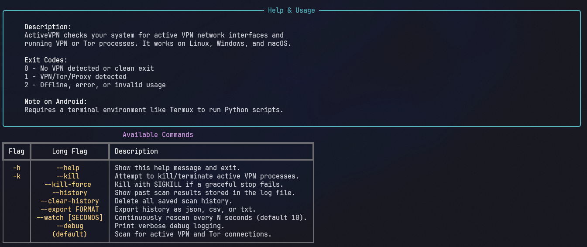
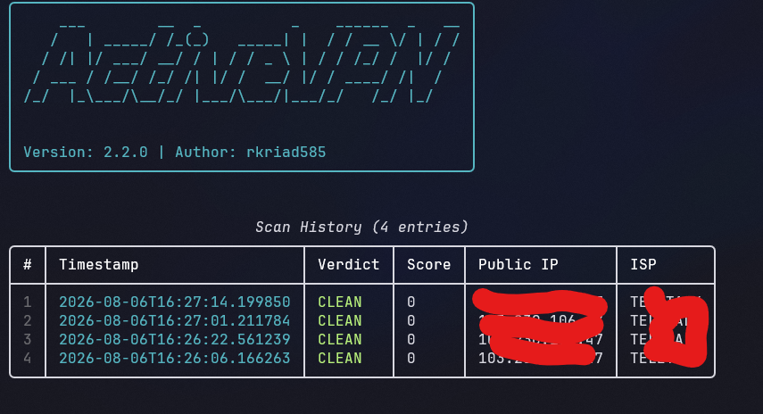

# Screenshots

Screenshots of ActiveVPN in action. All images live in the `Screenshots/` folder.

## home.png

The default scan output: system internal check, external IP analysis, DNS consistency check, and the overall verdict.

  

## Help.png

The help menu rendered with `activevpn --help`, listing every available command and the exit codes.

  

## History.png

The scan history table shown with `activevpn --history`.

  

---

<a href="../README.md">← Back to README</a>
